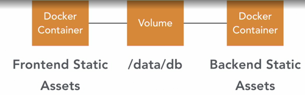

# Docker for developers

## Terms

- Image: contains information needed to build container; basically the binary of the container
- Container: the actual runtime instance of the image; where the ressource / application (MongoDB, React Frontend) is located
- Volume: holds data of containers (database, files etc)
- Networking: virtual network between the containers

## Dockerfile / .dockerignore

Dockerfile: blueprint for container

    # naming conventions
    # current directory = where Dockerfile is located or the directory specified at the end of the docker build command

    # Create a dockerfile for basic node application:

    # use the node base image from the docker registry
    # https://hub.docker.com/_/node
    FROM node

    # define, create and cd into the working directory inside the container
    WORKDIR /user/src/app

    # copy files from the current directory 
    # to the working directory defined above
    # same as COPY package*.json /user/src/app
    COPY package*.json ./

    # install the stuff from package.json inside the container
    RUN npm install

    # copy everything from the current directory
    # to the container's working dir
    # create a .dockerignore file to exclude directories such as node_modules
    COPY . .

    # open port 4000 of the container
    EXPOSE 4000

    #run "npm start"
    CMD ["npm", "start"]

## Create image from from a dockerfile

Create an image with name "pkro/simple-backend" using the current directory (`.`):

`docker build -t pkro/simple-backend .`

### Image related commands

- `docker images` shows all images on system
- `docker rmi [image id]` remove an image. ID can be just part of the ID as long as it can be uniquely identified (e.g. 492 instead of 492fb9ae4e7a, just like in git)

## Run container from an image

- Specify the containers port(s) to be published on the host with `-p hostport:containerport` (`-P` to publish all ports)
- use `-d` to detach it and run it in the background; otherwise you can see the stdout of the container in the console
- `-i` makes the stdout/stdin of the container interactive

`docker run -p 4001:4000 pkro/simple-backend`

In case of the example application in basic_node_container, the app serverd inside the container on port 4000 can now be accessed on the host on :

`http://localhost:4001`

### Container related commads

- `docker ps` show all running containers and their image ids
- `docker stop [ID]` what it says
- `docker logs [containerID]` see the stdout output of a container
- `docker push [imagename]` to push image to dockerhub
- `docker pull [imagename]` duh

[Reference of all docker commands](https://docs.docker.com/engine/reference/commandline/docker/)

## Building a backend, fronted and full stack application using docker

### Practical backend with compose

#### docker-compose

Allows to manage multiple containers in one file.

docker-compose.yml:

    # top level: the service names (defined by user, these could be any) or "services:"
    app:
        container_name: app
        restart: always
        # build from the Dockerfile in the current directory
        build: .
        # expose these ports, same as with docker run -p hostport:containerport
        ports:
            - "4001:4000"
        # dependencies: this one needs the mongo service defined below
        links:
            - mongo

    mongo:
        container_name: mongo
        # we use the official image from the docker registry,
        # so we don't need a dockerfile / build section for this
        image: mongo
        # expose container port 27017 **to other services**
        # that means this port is NOT accessible by the host machine
        # unless exposed using "ports" (see below)
        expose:
            - '27017'
        # link the data directory in the current folder to 
        # the /data/db directory inside the mongo container
        # so we have a persistent database
        volumes:
            - ./data:/data/db
        # expose port to host machine
        # if only one port is specified, docker will assign a random
        # host machine port to the specified container port
        ports:
            - "27017:27017"

The mongo service can then be accessed by the app container like this (node example), *NOT* by `localhost`:

    mongoose.connect('mongodb://mongo:27017/crm', {
        useMongoClient: true
    });

The containers can then be built with `docker-compose build` or `docker-compose up`, which will build if it doesn't exist and then start the containers.

Single services (containers) can be started using `docker-compose up -d [servicename]`, e.g. `docker-compose up -d mongo`

Use `docker-compose down` or `docker-compose stop` in the docker-compose.yml files directory to stop all containers.

- `docker images` shows all images created on the system
- `docker rmi [imageID] to remove an image

Docker compose example that includes node backend, mongodb and a react frontend:

    # docker-compose yaml version
    version: "3"
    # the services to install
    services: 
        # the service names (defined by user, these could be any)
        app:
            container_name: app
            restart: unless-stopped
            # build from the Dockerfile in [current folder on host]/api
            # basically calls
            # "docker build ./api" to build the dockerfile located there
            build: ./api
            # expose these ports, same as with docker run -p hostport:containerport
            ports:
            - "4001:4000"
            # dependencies: this one needs the mongo service defined below
            # Containers for the linked service will be reachable at a hostname identical to the alias, 
            # or the service name if no alias was specified.
            # so in this case mongo will be reachable by mongo:
            # also ensures right order of startup of services
            links:
            - mongo
    
        client:
            container_name: client
            restart: unless-stopped
            build: ./client
            ports: 
            - "3000:3000"
            links:
            - app
    
        mongo:
            container_name: mongo
            # we use the official image from the docker registry,
            # so we don't need a dockerfile / build section for this
            image: mongo
            # restart policy
            # no / on-failure / always / unless-stopped
            restart: unless-stopped
            # expose container port 27017 **to other services**
            # that means this port is NOT accessible by the host machine
            # unless exposed using "ports" (see below)
            
            expose:
            - '27017'
            # link the data directory in the current folder to 
            # the /data/db directory inside the mongo container
            # so we have a persistent database
            volumes:
            - ./data:/data/db
            # expose port to host machine
            # if only one port is specified, docker will assign a random
            # host machine port to the specified container port
            ports:
            - "27017:27017"

## Tips for other languages

For image bases (apache, spring, wordpress, etc.) look for the images on dockerhub to put into the `FROM:` section.

## CI (Continuous integration) and depoloyment with jenkins docker

*TODO:  As travis-ci isn't free anymore check installing a local jenkins*

Basic CI process:

Develop - commit changes to repo - CI provider (e.g. Travis CI) tests the build and deploys

Create .travis.yml in the apps directory ("node" in this example repo)

sudo: required
services:
  - docker

        # run commands
        script:
        # use own dockerhub ID, here: pkro, as we want to push it to the docker registry as deployment
        - docker build -t pkro/node .
        # just shows the image on stout (?)
        - docker images pkro/node

        before_deploy:
        - docker login -u pkro -p <dockerhub pass or token>
        deploy:
        provider: script
        script: docker push pkro/node
        on:
            branch: main

Create a repo on github as usual and push everything there. Be sure to include .travis.yml in the commit (somehow it was ignored by `git add *` - investigate)

Go to travis.com (travis.org is discontinued) and add the github repositories (upper right, settings) then trigger a build on the dashboard.

When a build has been triggered by a commit/push or manually, we need to configure what needs to be done with it.

Here, we'll deploy it to the docker registry.